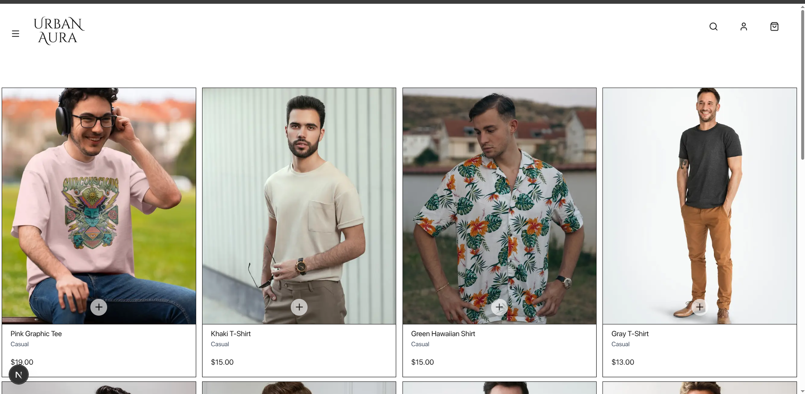
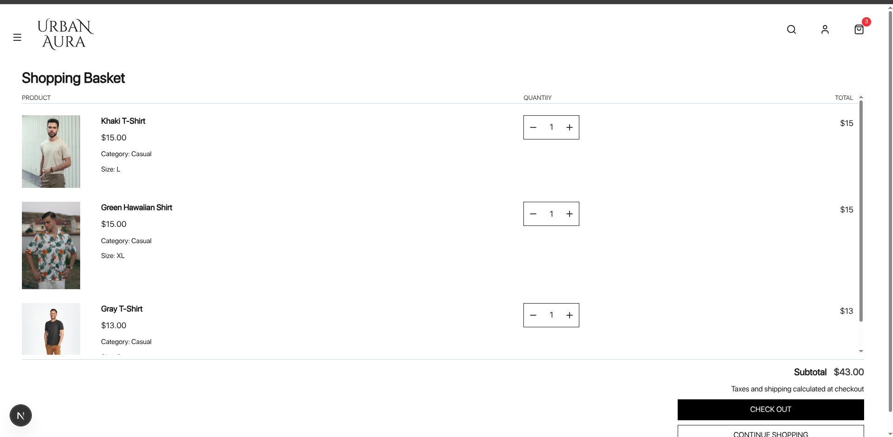
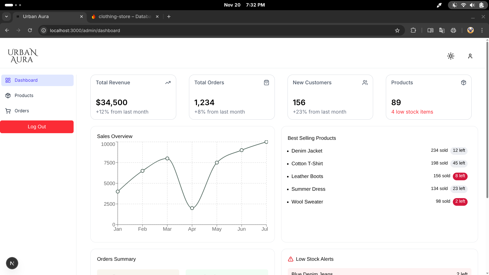
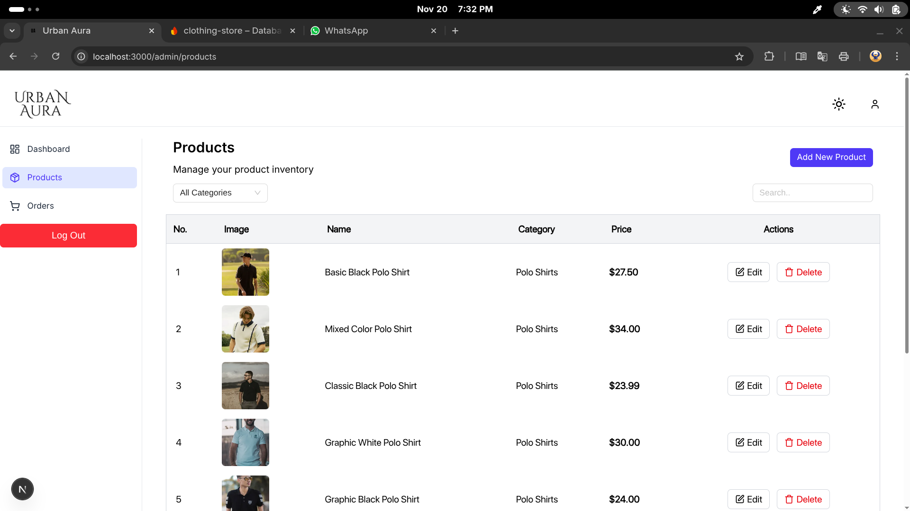

# E-Store

A front-end e-commerce project built as a personal learning and practice exercise.  
It includes a product listing interface, proper cart functionality, and a responsive layout.  
This repository is intended for **code review and demonstration only**.

---

## Important Notice

This project is **not intended to be run by external users**.

The application depends on a custom Firebase backend with:

- A private Firebase project
- Custom Firestore collections and document structures
- Authentication rules
- Storage rules 
- Environment files and API keys

Because these elements are specific to my development environment and not replicated here, the project will not function without recreating the entire backend.  
For this reason, setup instructions are intentionally not provided.

---

## Features

- Product listing interface
- Product detail layout or modal
- Cart UI with add/remove operations
- Responsive design
- Minimal and clean UI

---

## Screenshots

  
  
  
  

---

## Purpose

This project was created to practice front-end development, UI layout design, and basic e-commerce workflows.  
It serves as a portfolio piece rather than a deployable application.
